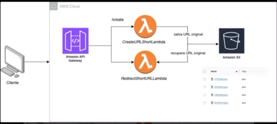

# URL Shortener Project

## Descrição do Projeto
Este projeto é um encurtador de URLs que utiliza serviços da AWS para criar e gerenciar URLs curtas. O objetivo é fornecer uma maneira simples e eficiente de encurtar URLs longas, armazenando e recuperando as URLs originais conforme necessário.

## Ferramentas Utilizadas
- **Amazon API Gateway**: Serve como ponto de entrada para as requisições dos clientes. Ele roteia as requisições para as funções Lambda apropriadas.
- **AWS Lambda**: Utilizado para executar o código sem a necessidade de gerenciar servidores. Duas funções Lambda são usadas:
  - `CreateURLShortLambda`: Responsável por criar a URL curta e salvar a URL original no Amazon S3.
  - `RedirectShortURLLambda`: Responsável por recuperar a URL original a partir da URL curta.
- **Amazon S3**: Utilizado para armazenar as URLs originais.

## Diagrama do Projeto

  

## Fluxo de Trabalho
1. **Cliente**: O cliente faz uma requisição para encurtar uma URL ou acessar uma URL curta.
2. **Amazon API Gateway**: Recebe a requisição e a direciona para a função Lambda apropriada.
3. **AWS Lambda**:
   - `CreateURLShortLambda`: Cria uma URL curta e salva a URL original no Amazon S3.
   - `RedirectShortURLLambda`: Recupera a URL original a partir da URL curta.
4. **Amazon S3**: Armazena as URLs originais e permite que sejam recuperadas pelas funções Lambda.

Este projeto é interessante e relevante porque demonstra como utilizar serviços da AWS para criar uma aplicação serverless eficiente e escalável. A utilização de AWS Lambda e Amazon S3 permite que o projeto seja altamente disponível e de fácil manutenção.
